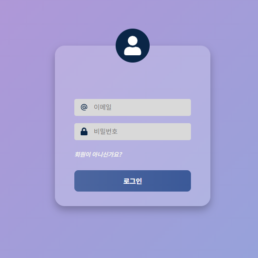
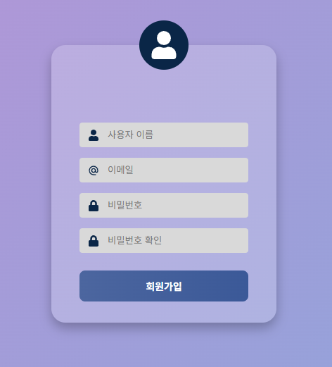
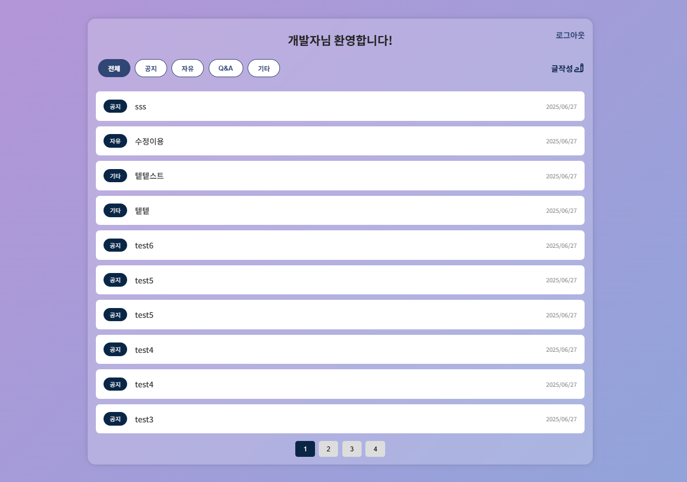
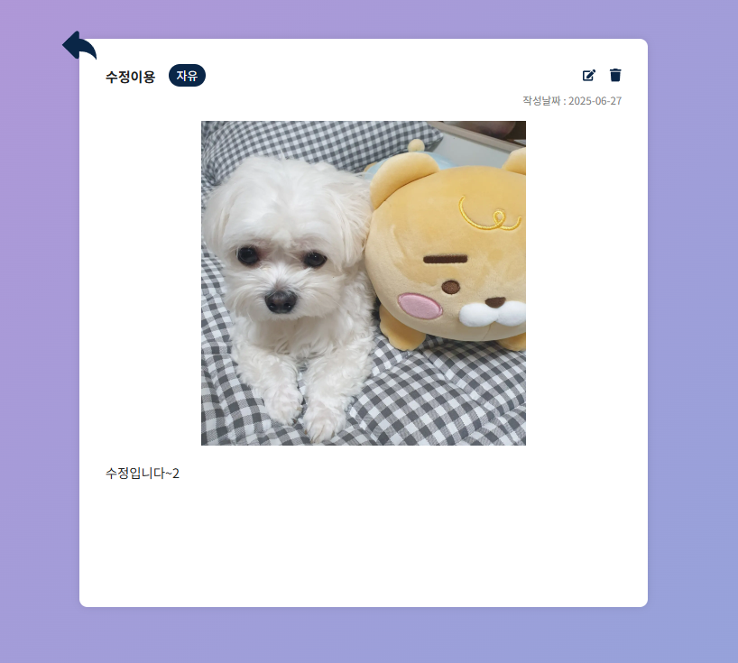
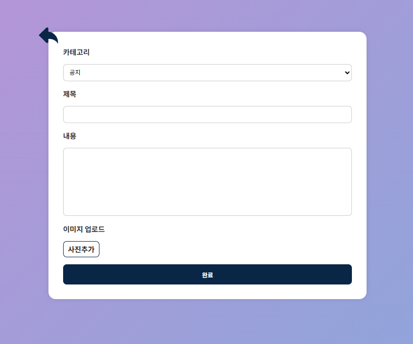
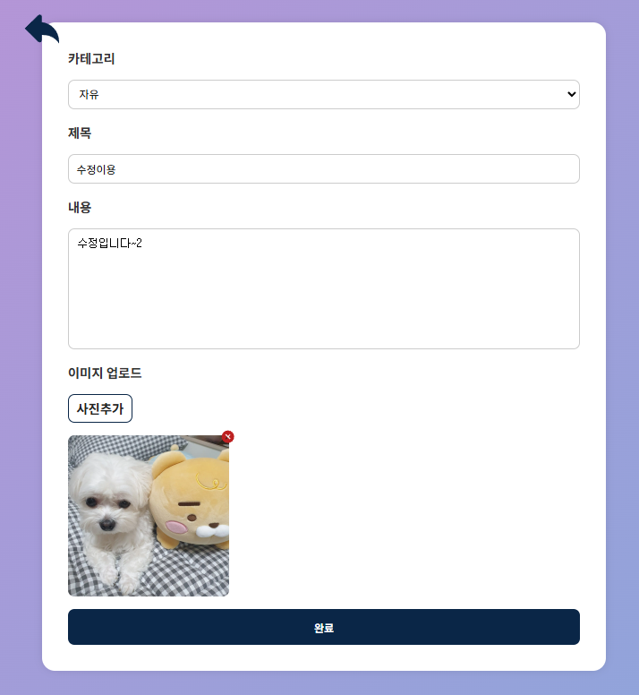

# 🧾 BIGS-MISSION

React를 활용한 게시판 프로젝트 입니다.

## 배포주소

```base
https://bigs-project.vercel.app
```

## 사용 기술

> 프론트엔드

- React + TypeScript
- Styled-componts
- React-Query
- MobX

## 구현 기능 체크리스트

- [x] 로그인 & 회원가입
  - 유효성 검사 후 로그인 및 회원가입, 로그인 시 발급 받은 토큰을 스토리지에 저장
  - 발급 받은 토큰에 저장된 유저 정보를 store에 저장
- [x] 로그아웃
  - 로그아웃 시 store와 스토리지를 초기화
  - 로그아웃 후 게시글 조회/작성/수정등 페이지 접근 시 토큰 확인 후 로그인 화면 전환
- [x] 작성된 게시글 목록 조회
  - 기존에 작성된 게시글 목록을 페이지당 최대 10개씩 출력
  - 작성시간 기준 최신순으로 정렬
- [x] 카테고리별 필터링 기능
  - 전체/공지/자유/Q&A/기타 총 5가지로 게시글을 필터링
  - boardStore를 통해 카테고리와 페이지 상태 유지
    <br/> **_(기존에 페이징처리를 통해 페이지별 새롭게 데이터를 요청했으나 제공받은 api에는 필터링에 어려움이 있어 부득이하게 전체 리스트를 조회 후 페이징 및 필터링 처리하였습니다.)_**
- [x] 게시글 CRUD 구현
  - 글작성 버튼을 통해 새로운 게시글을 작성
  - 조회한 게시글을 클릭해 상세 내용을 확인
  - 상세페이지에서는 수정 또는 삭제할 수 있습니다.
- [x] 반응형 디자인

  - 미디어 쿼리를 사용해 '1024px','768px'별로 간단하게 대응 가능하도록 구현했습니다.

  ```bash
  api 요청시 interceptors를 통해 헤더에 토큰을 주입하고, 응답에 따라 토큰을 재발급 또는 재로그인을 요청하도록 구현하였습니다.

  accessToken만료 -> reFreshToken으로 재발급요청 -> reFreshToken만료 -> 로그인 재요청
  ```

## 🗂️ 프로젝트 구조

```
├── src # 컴포넌트, 스토어, 스타일 등
│ └── API # api호출을 위한 instance 생성 및 interceptors
│ └── components # 컴포넌트
│   └── Auth # 로그인 컴포넌트
│   └── Board # 게시판 컴포넌트
│   └── Common # Taost, Spinner 등
│ └── hooks # api호출 등 커스텀 훅
│ └── store # userStore, boardStore 등 전역상태 관리
│ └── ...
```

## 프로젝트 실행 방법

1. `.env` 파일을 프로젝트 루트에 만들고 아래 내용을 참고해 채워주세요

```bash
REACT_APP_API_BASE_URL=https://front-mission.bigs.or.kr
```

2. dependencies 설치 및 실행

```bash
npm install
npm start
```

## 실행 화면

1. 로그인/회원가입
<p align="center">   </p>

2. 게시글 목록/상세
   <p align="center">    </p>

3. 게시글 작성/수정
   <p align="center">    </p>
